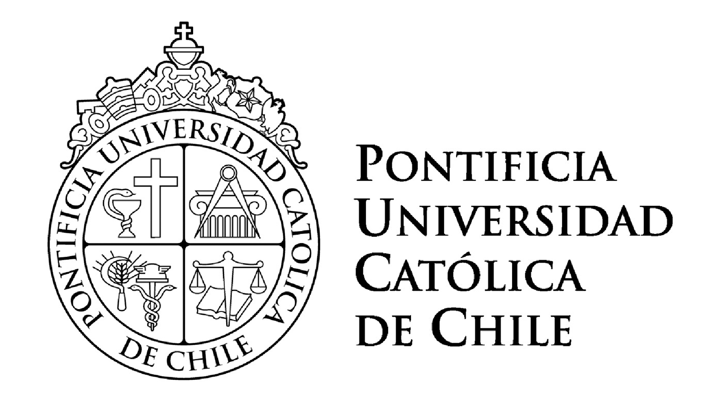
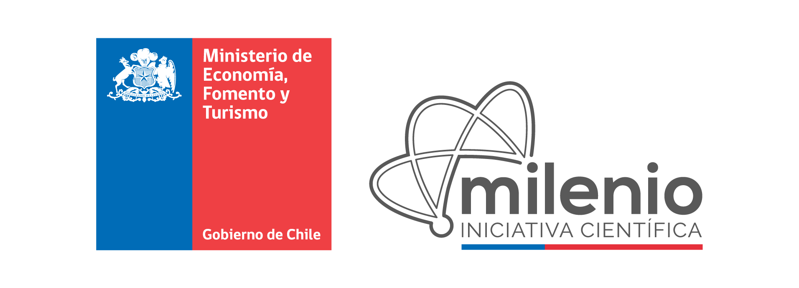

<a href="#program">Program</a> | <a href="#registration">Registration</a> | <a href="#logistics">Logistics</a>
---
# Latin American Political Methodology Meeting

Welcome! We are excited to announce the first Latin American PolMeth meeting. The event will take place in November 17 and 18 in Santiago de Chile, and will feature a day of public talks and a day of workshops for participant's manuscripts. It is hosted by the Pontificia Universidad Católica de Chile, with support from Princeton University. 

The meeting will feature keynote talks by Kosuke Imai of Princeton University (current president of the Society for Political Methodology) and by Rocío Titiunik of the University of Michigan (recent recipient of the Emerging Scholar Award by the Society of Political Methodology). 

## Program

A preliminary program for the event can be found [here](https://docs.google.com/document/d/1R7mAs7t6DxL9360jTUCED_eNJP-t_ukchillBr082SA/pub). 

## Registration

To register for the meeting, fill out the registration form [here](https://goo.gl/forms/7LLcVxCgOA3ASaRh2). **The event has no registration fee. However, space is limited, and registration is required for those wishing to take part in the workshops.**

## Logistics

### Meeting location
The meeting will take place in **Santiago, Chile**, at the Universidad Católica (San Joaquin campus), on **November 17 and 18, 2017**. The nearest Metro stop is **Estacion San Joaquin**.

All events will take place at the lower level of the _Facultad de Historia, Geografia y Ciencia Politica_, marked by a black circle in the following map:

 

The closest entrance to campus is on Monseñor Carlos Casanueva, although you can also uise the entrance on Avenida Vicuña Mackenna, which is closest to the metro stop (San Joaquin).  

### Event format
There will be a day of public presentations which will be open to the public, and which feature two keynote talks and one roundtable discussion. There will also be a day of paper workshops, which will be restricted to registered participants. During this day, previously circulated manuscipts will be actively discussed, and no presentation will take place. There will be a short social event for all registered participants.  

All talks and sessions will be held in English.

### Lodging options & information about the city
AirBnB is a great option for affordable and convenient lodging. 

We recommend you find a place near the following neighborhoods:
- Bellas Artes/Lastarria: Good night life, easy metro access and simple route to the PUC San Joaquin Campus.
- Near Tobalaba metro station: Close to metro, dining and shopping. Trip to San Joaquin Campus of PUC requires transfer to green line.   

For more information about the city, please visit http://chile.travel/en/.

### Organizing team

- Juan Pablo Luna (Pontifica Universidad Católica, Chile)
- Jake Bowers (University of Illinois at Urbana Champaign, USA)
- Laura Wills Otero (Universidad de los Andes, Colombia)
- John B. Londregan (Princeton University, USA)
- Santiago Olivella (University of North Carolina at Chapel Hill, USA)

### Sponsors

   

  

